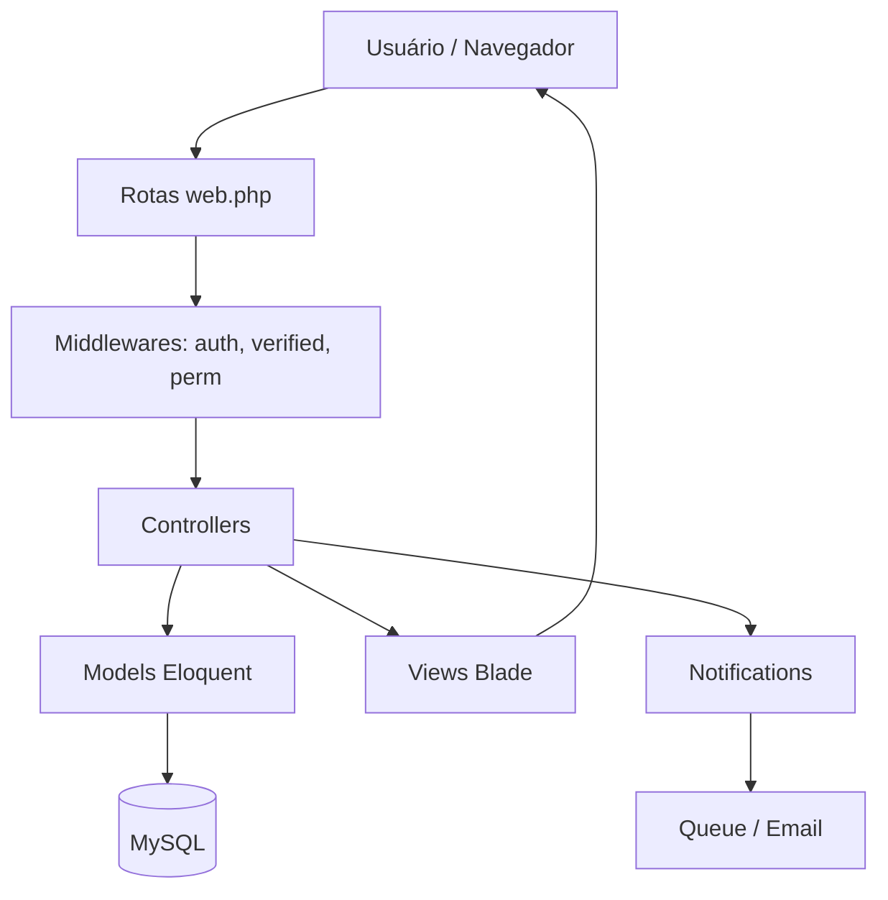
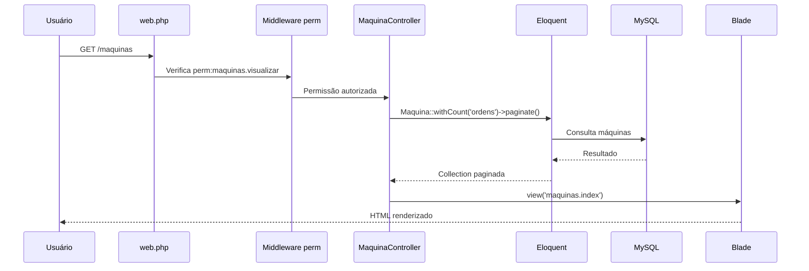
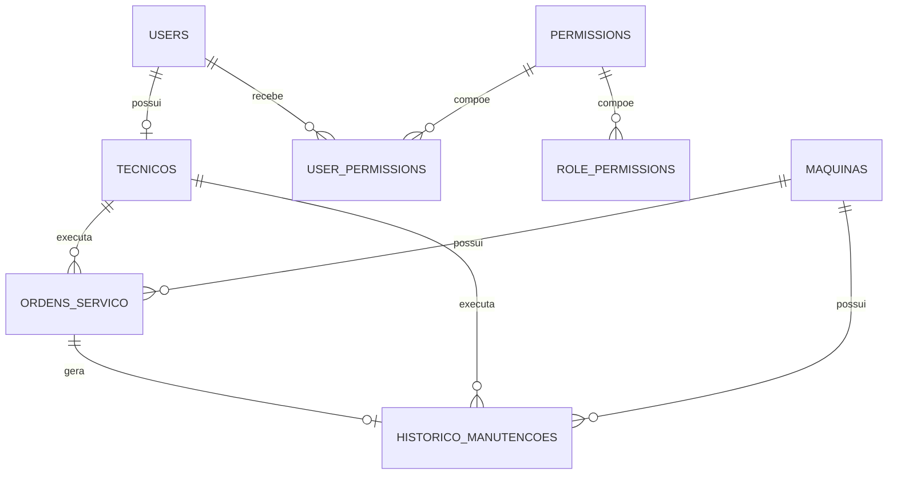

# MaintSys — Documentação Técnica

> Documentação gerada a partir do código-fonte fornecido do sistema Laravel **MaintSys**, voltado ao gerenciamento de manutenção de máquinas.

---

## 1. Visão Geral

O **MaintSys** é um sistema web de gerenciamento de manutenção de máquinas, desenvolvido em **Laravel 11**, com foco no controle de equipamentos, técnicos, ordens de serviço, histórico de manutenção e permissões de acesso.

### Objetivo do sistema

O sistema tem como objetivo centralizar e organizar o processo de manutenção industrial, permitindo:

- Cadastro e controle de máquinas.
- Cadastro de técnicos responsáveis pelas manutenções.
- Abertura, acompanhamento, edição e conclusão de Ordens de Serviço.
- Geração automática de histórico ao concluir uma O.S.
- Controle automático do status operacional das máquinas.
- Agendamento automático de próxima manutenção preventiva.
- Controle de acesso por perfil e permissões individuais.
- Consulta de histórico por máquina, técnico, tipo e período.
- Exportação de dados em CSV.
- Notificações ao técnico quando uma O.S. é atribuída.

### Público-alvo

O sistema atende principalmente:

- Equipes de manutenção.
- Gestores de manutenção.
- Técnicos responsáveis por execução de O.S.
- Administradores do sistema.
- Usuários com necessidade de consulta de máquinas, ordens e históricos.

### Problemas que resolve

O MaintSys resolve problemas comuns em ambientes industriais, como:

- Falta de rastreabilidade das manutenções.
- Controle manual de Ordens de Serviço.
- Dificuldade para identificar máquinas em manutenção ou parada crítica.
- Falta de histórico técnico consolidado.
- Falhas no controle de permissões.
- Ausência de padronização no número das O.S.
- Dificuldade de planejar manutenções preventivas.

---

## 2. Arquitetura

O MaintSys utiliza a arquitetura padrão do Laravel, baseada em **MVC**, com persistência via **Eloquent ORM**, autenticação via **Laravel Breeze**, views em **Blade Templates** e interface com **Tailwind CSS**.

### Stack principal

| Camada | Tecnologia |
|---|---|
| Backend | Laravel 11 |
| Linguagem | PHP 8.2+ |
| ORM | Eloquent |
| Banco de dados | MySQL |
| Frontend server-side | Blade Templates |
| Estilização | Tailwind CSS |
| Autenticação | Laravel Breeze |
| Notificações | Laravel Notifications |
| Exportação | CSV via `streamDownload` |
| Controle de acesso | Middleware customizado `CheckPermission` |

### Diagrama de camadas



### Padrões utilizados

#### MVC

O sistema segue o padrão **Model-View-Controller**:

- **Models**: representam as entidades do domínio e seus relacionamentos.
- **Controllers**: concentram regras de aplicação, validação e orquestração.
- **Views**: renderizam a interface com Blade e Tailwind.

#### Eloquent ORM

O Eloquent é utilizado para:

- Mapear tabelas para classes.
- Definir relacionamentos.
- Criar scopes reutilizáveis.
- Aplicar casts de tipos.
- Consultar e persistir dados.

#### Middleware

O middleware `CheckPermission` protege rotas com base em permissões.

Fluxo simplificado:

```php
if (!$user || !$user->hasPermission($perm)) {
    abort(403, "Acesso negado: permissão necessária '$perm'.");
}
```

### Fluxo de uma requisição

Exemplo: acesso à tela de máquinas.



---

## 3. Modelo de Dados

A documentação abaixo foi inferida a partir dos Models e Controllers fornecidos.

---

### 3.1 Tabela `users`

Representa os usuários autenticáveis do sistema.

| Campo | Tipo provável | Obrigatório | Observação |
|---|---:|---:|---|
| `id` | bigint | Sim | Chave primária |
| `name` | string | Sim | Nome do usuário |
| `email` | string | Sim | Único |
| `password` | string | Sim | Hash automático |
| `role` | enum/string | Sim | Perfil do usuário |
| `permissions_overridden` | boolean | Sim | Define se usa permissões individuais |
| `email_verified_at` | datetime | Não | Verificação de e-mail |
| `remember_token` | string | Não | Token de sessão |
| `created_at` | timestamp | Sim | Padrão Laravel |
| `updated_at` | timestamp | Sim | Padrão Laravel |

#### Enums válidos para `role`

| Valor | Descrição |
|---|---|
| `admin_master` | Administrador master; possui todas as permissões |
| `admin` | Administrador comum |
| `usuario` | Usuário comum/técnico |

#### Relacionamentos

| Relacionamento | Tipo | Destino |
|---|---|---|
| `tecnico()` | `hasOne` | `Tecnico` |
| `userPermissions()` | `hasMany` | `UserPermission` |

---

### 3.2 Tabela `maquinas`

Representa os equipamentos controlados pelo sistema.

| Campo | Tipo provável | Obrigatório | Observação |
|---|---:|---:|---|
| `id` | bigint | Sim | Chave primária |
| `numero_serie` | string | Sim | Único |
| `modelo` | string | Sim | Modelo da máquina |
| `fabricante` | string | Não | Fabricante |
| `localizacao` | string | Sim | Local onde a máquina está instalada |
| `data_cadastro` | date | Não | Data de cadastro |
| `status` | enum/string | Sim | Situação da máquina |
| `descricao` | text | Não | Descrição livre |
| `created_at` | timestamp | Sim | Padrão Laravel |
| `updated_at` | timestamp | Sim | Padrão Laravel |

#### Enums válidos para `status`

| Valor | Label | Cor |
|---|---|---|
| `operacional` | Operacional | green |
| `em_manutencao` | Em Manutenção | yellow |
| `parada_critica` | Parada Crítica | red |
| `inativa` | Inativa | gray |

#### Relacionamentos

| Relacionamento | Tipo | Destino |
|---|---|---|
| `ordens()` | `hasMany` | `OrdemServico` |
| `historicos()` | `hasMany` | `HistoricoManutencao` |

#### Scopes

| Scope | Filtro aplicado |
|---|---|
| `operacional()` | `status = operacional` |
| `emManutencao()` | `status = em_manutencao` |
| `paradaCritica()` | `status = parada_critica` |

---

### 3.3 Tabela `tecnicos`

Representa técnicos de manutenção.

| Campo | Tipo provável | Obrigatório | Observação |
|---|---:|---:|---|
| `id` | bigint | Sim | Chave primária |
| `user_id` | bigint | Não/Sim | Relaciona com `users` |
| `nome` | string | Sim | Nome do técnico |
| `matricula` | string | Sim | Única |
| `email` | string | Sim | Único em `tecnicos` e `users` |
| `password` | string | Sim | Hash da senha |
| `especialidade` | string | Não | Área técnica |
| `telefone` | string | Não | Contato |
| `ativo` | boolean | Sim | Status do técnico |
| `created_at` | timestamp | Sim | Padrão Laravel |
| `updated_at` | timestamp | Sim | Padrão Laravel |

#### Relacionamentos

| Relacionamento | Tipo | Destino |
|---|---|---|
| `ordens()` | `hasMany` | `OrdemServico` |
| `user()` | `belongsTo` | `User` |
| `historicos()` | `hasMany` | `HistoricoManutencao` |

---

### 3.4 Tabela `ordens_servico`

Representa as Ordens de Serviço.

| Campo | Tipo provável | Obrigatório | Observação |
|---|---:|---:|---|
| `id` | bigint | Sim | Chave primária |
| `numero` | string | Sim | Gerado automaticamente |
| `tipo` | enum/string | Sim | Preventiva ou corretiva |
| `status` | enum/string | Sim | Estado da O.S. |
| `prioridade` | enum/string | Sim | Prioridade |
| `descricao` | text | Sim | Descrição do problema/serviço |
| `solucao` | text | Não | Solução aplicada |
| `maquina_id` | bigint | Sim | FK para `maquinas` |
| `tecnico_id` | bigint | Sim | FK para `tecnicos` |
| `data_abertura` | datetime | Sim | Data/hora de abertura |
| `data_prevista` | date | Não | Data prevista |
| `data_conclusao` | datetime | Não | Preenchida ao concluir |
| `created_at` | timestamp | Sim | Padrão Laravel |
| `updated_at` | timestamp | Sim | Padrão Laravel |

#### Enums válidos para `tipo`

| Valor | Label |
|---|---|
| `preventiva` | Preventiva |
| `corretiva` | Corretiva |

#### Enums válidos para `status`

| Valor | Label |
|---|---|
| `aberta` | Aberta |
| `em_andamento` | Em Andamento |
| `concluida` | Concluída |
| `cancelada` | Cancelada |

#### Enums válidos para `prioridade`

| Valor | Label |
|---|---|
| `baixa` | Baixa |
| `media` | Média |
| `alta` | Alta |
| `critica` | Crítica |

#### Relacionamentos

| Relacionamento | Tipo | Destino |
|---|---|---|
| `maquina()` | `belongsTo` | `Maquina` |
| `tecnico()` | `belongsTo` | `Tecnico` |
| `historico()` | `hasOne` | `HistoricoManutencao` |

---

### 3.5 Tabela `historico_manutencoes`

Representa registros históricos de manutenção.

| Campo | Tipo provável | Obrigatório | Observação |
|---|---:|---:|---|
| `id` | bigint | Sim | Chave primária |
| `maquina_id` | bigint | Sim | FK para `maquinas` |
| `tecnico_id` | bigint | Sim | FK para `tecnicos` |
| `ordem_id` | bigint | Não/Sim | FK para O.S. de origem |
| `tipo` | enum/string | Sim | Preventiva ou corretiva |
| `descricao` | text | Sim | Descrição da manutenção |
| `solucao` | text | Não | Solução aplicada |
| `pecas_utilizadas` | text | Não | Peças utilizadas |
| `tempo_parada_horas` | decimal(?,2) | Não | Tempo de parada |
| `custo` | decimal(?,2) | Não | Custo |
| `data_inicio` | datetime | Sim | Início da manutenção |
| `data_fim` | datetime | Sim | Fim da manutenção |
| `observacoes` | text | Não | Observações |
| `created_at` | timestamp | Sim | Padrão Laravel |
| `updated_at` | timestamp | Sim | Padrão Laravel |

#### Relacionamentos

| Relacionamento | Tipo | Destino |
|---|---|---|
| `maquina()` | `belongsTo` | `Maquina` |
| `tecnico()` | `belongsTo` | `Tecnico` |
| `ordem()` | `belongsTo` | `OrdemServico` |

---

### 3.6 Tabela `permissions`

Representa permissões do sistema.

| Campo | Tipo provável | Observação |
|---|---:|---|
| `id` | bigint | Chave primária |
| `name` | string | Nome técnico da permissão |
| `modulo` | string | Agrupamento por módulo |
| `created_at` | timestamp | Padrão Laravel |
| `updated_at` | timestamp | Padrão Laravel |

Exemplos de permissões:

- `maquinas.visualizar`
- `maquinas.criar`
- `maquinas.editar`
- `maquinas.deletar`
- `ordens.visualizar`
- `ordens.criar`
- `ordens.editar`
- `ordens.deletar`
- `historico.visualizar`
- `acesso.gerenciar`

---

### 3.7 Tabela `role_permissions`

Representa permissões atribuídas por perfil.

| Campo | Tipo provável | Observação |
|---|---:|---|
| `id` | bigint | Chave primária |
| `role` | string/enum | `admin` ou `usuario` |
| `permission_id` | bigint | FK para `permissions` |

---

### 3.8 Tabela `user_permissions`

Representa permissões individuais atribuídas diretamente a usuários.

| Campo | Tipo provável | Observação |
|---|---:|---|
| `id` | bigint | Chave primária |
| `user_id` | bigint | FK para `users` |
| `permission_id` | bigint | FK para `permissions` |

---

### 3.9 Relacionamento geral entre entidades



---

## 4. Regras de Negócio

---

### 4.1 Geração do número da O.S.

A numeração da Ordem de Serviço é gerada pelo método estático:

```php
OrdemServico::gerarNumero()
```

Formato:

```text
OS-YYYYMMDD-NNNN
```

Exemplo:

```text
OS-20260608-0001
```

#### Regras

1. O prefixo é formado pela data atual:

```php
$prefix = 'OS-' . now()->format('Ymd') . '-';
```

2. O sistema busca a última O.S. criada no dia com o mesmo prefixo.

3. A consulta utiliza `lockForUpdate()` para evitar duplicidade em criação concorrente dentro de transações.

```php
$ultimo = self::where('numero','like',$prefix.'%')
    ->lockForUpdate()
    ->orderByDesc('numero')
    ->value('numero');
```

4. Se existir O.S. no dia, incrementa os últimos 4 dígitos.

5. Se não existir, inicia em `0001`.

6. O número final é preenchido com zeros à esquerda:

```php
str_pad($proximo, 4, '0', STR_PAD_LEFT)
```

---

### 4.2 Sincronização automática do status da máquina

A sincronização é feita pelo método privado:

```php
sincronizarStatusMaquina(int $maquinaId): ?string
```

Esse método é chamado quando:

- Uma O.S. é criada.
- Uma O.S. é atualizada.
- Uma O.S. é deletada.
- Uma O.S. muda de máquina.
- Uma O.S. é concluída ou cancelada.

#### Conceito de ordem ativa

Uma máquina é considerada com ordem ativa quando existe O.S. da máquina com status:

```text
aberta
em_andamento
```

E que atenda pelo menos uma das condições:

- A O.S. está `em_andamento`.
- A O.S. é do tipo `corretiva`.
- A O.S. não possui `data_prevista`.
- A O.S. possui `data_prevista` menor ou igual à data atual.

Código equivalente:

```php
$temOrdemAtiva = OrdemServico::where('maquina_id',$maquinaId)
    ->whereIn('status',['aberta','em_andamento'])
    ->where(function($query) {
        $query->where('status','em_andamento')
            ->orWhere('tipo','corretiva')
            ->orWhereNull('data_prevista')
            ->orWhereDate('data_prevista','<=',today());
    })->exists();
```

#### Quando muda para `em_manutencao`

A máquina muda de `operacional` para `em_manutencao` quando:

- Existe ordem ativa para a máquina.
- O status atual da máquina é `operacional`.

```php
if ($temOrdemAtiva && $maquina->status === 'operacional') {
    $maquina->update(['status'=>'em_manutencao']);
}
```

#### Quando volta para `operacional`

A máquina volta de `em_manutencao` para `operacional` quando:

- Não existe mais ordem ativa para a máquina.
- O status atual da máquina é `em_manutencao`.

```php
if (!$temOrdemAtiva && $maquina->status === 'em_manutencao') {
    $maquina->update(['status'=>'operacional']);
}
```

#### Quando NÃO muda

O status da máquina não muda quando:

- A máquina já está `parada_critica`.
- A máquina está `inativa`.
- Existe ordem ativa, mas a máquina não está `operacional`.
- Não existe ordem ativa, mas a máquina não está `em_manutencao`.
- A O.S. aberta é preventiva futura, com `data_prevista` maior que hoje, e não está `em_andamento`.
- A O.S. está `concluida` ou `cancelada`.
- A máquina não é encontrada.

#### Observação importante

O método não altera automaticamente máquinas em `parada_critica` para `em_manutencao` nem para `operacional`. Esse status precisa ser tratado explicitamente por edição da máquina.

---

### 4.3 Criação automática de histórico ao concluir uma O.S.

Quando uma O.S. é atualizada para o status `concluida`, o sistema cria um registro em `historico_manutencoes`.

A conclusão é identificada por:

```php
$concluindoAgora = $data['status'] === 'concluida'
    && $statusAnterior !== 'concluida';
```

Ao concluir:

1. Define `data_conclusao = now()`.
2. Atualiza a O.S.
3. Cria um histórico com os dados da O.S.
4. Copia máquina, técnico, tipo, descrição e solução.
5. Registra tempo de parada, custo e peças utilizadas.
6. Usa `data_abertura` como `data_inicio`.
7. Usa `data_conclusao` como `data_fim`.

Campos gravados no histórico:

```php
[
    'maquina_id'         => $ordem->maquina_id,
    'tecnico_id'         => $ordem->tecnico_id,
    'ordem_id'           => $ordem->id,
    'tipo'               => $ordem->tipo,
    'descricao'          => $ordem->descricao,
    'solucao'            => $ordem->solucao,
    'tempo_parada_horas' => $dadosConclusao['tempo_parada_horas'],
    'custo'              => $dadosConclusao['custo'],
    'pecas_utilizadas'   => $dadosConclusao['pecas_utilizadas'],
    'data_inicio'        => $ordem->data_abertura,
    'data_fim'           => $ordem->data_conclusao,
]
```

#### Atualização de histórico já existente

Se a O.S. já estiver concluída e possuir histórico, o sistema atualiza dados básicos do histórico:

- Máquina.
- Técnico.
- Tipo.
- Descrição.
- Solução.

---

### 4.4 Restrição: O.S. concluída não pode ser reaberta

O sistema impede alterar uma O.S. concluída para qualquer outro status.

Regra:

```php
if ($statusAnterior === 'concluida' && $data['status'] !== 'concluida') {
    return back()->withInput()->with('error','Não é possível reabrir O.S. já concluída.');
}
```

Portanto, após concluída, a O.S. permanece concluída.

---

### 4.5 Geração automática da próxima preventiva

Ao concluir uma O.S. do tipo `preventiva`, o sistema pode gerar automaticamente uma nova preventiva.

Condições necessárias:

- A O.S. está sendo concluída agora.
- A O.S. é do tipo `preventiva`.
- O campo `proxima_preventiva` foi informado.
- A data da próxima preventiva é maior ou igual a hoje.

Validação:

```php
'proxima_preventiva' => 'nullable|date|after_or_equal:today'
```

Criação da nova O.S.:

```php
OrdemServico::create([
    'numero'        => OrdemServico::gerarNumero(),
    'tipo'          => 'preventiva',
    'status'        => 'aberta',
    'prioridade'    => $ordem->prioridade,
    'descricao'     => 'Manutencao preventiva programada (gerada automaticamente)',
    'maquina_id'    => $ordem->maquina_id,
    'tecnico_id'    => $ordem->tecnico_id,
    'data_abertura' => now(),
    'data_prevista' => $proximaPreventiva,
]);
```

A nova O.S. herda:

- Prioridade da O.S. concluída.
- Máquina.
- Técnico.

A nova O.S. recebe:

- Novo número.
- Tipo `preventiva`.
- Status `aberta`.
- Data prevista informada.

Após criada, a nova O.S. é incluída na lista de notificações ao técnico.

---

### 4.6 Notificação ao técnico atribuído

Quando uma O.S. é criada ou quando o técnico responsável é alterado, o sistema envia notificação ao usuário vinculado ao técnico.

Método responsável:

```php
notificarTecnicoAtribuido(OrdemServico $ordem)
```

Fluxo:

1. Carrega máquina, técnico e usuário do técnico.
2. Verifica se existe usuário vinculado.
3. Envia a notificação `OrdemServicoAtribuida`.

```php
$user->notify(new OrdemServicoAtribuida($ordem));
```

---

### 4.7 Sistema de permissões

O sistema possui controle de acesso baseado em:

- Papel do usuário (`role`).
- Permissões herdadas do papel.
- Permissões individuais.
- Flag `permissions_overridden`.
- Cache em memória por instância do Model.

#### Papéis disponíveis

| Role | Descrição |
|---|---|
| `admin_master` | Possui todas as permissões automaticamente |
| `admin` | Usa permissões configuradas para o papel admin |
| `usuario` | Usa permissões configuradas para o papel usuario |

#### Admin Master

O `admin_master` sempre possui todas as permissões.

```php
public function hasPermission(string $perm): bool {
    if ($this->isMaster()) return true;
    return in_array($perm, $this->permissionNames(), true);
}
```

#### Permissões herdadas por role

Quando `permissions_overridden = false`, o sistema busca permissões na tabela `role_permissions`.

```php
RolePermission::with('permission')
    ->where('role', $this->role)
    ->get()
    ->pluck('permission.name');
```

#### Permissões individuais

Quando `permissions_overridden = true`, o sistema ignora as permissões da role e busca permissões em `user_permissions`.

```php
$this->userPermissions()
    ->with('permission')
    ->get()
    ->pluck('permission.name');
```

#### Cache em memória

O usuário possui cache local na propriedade:

```php
protected ?array $permissionNamesCache = null;
```

Se o cache já foi preenchido, ele é reutilizado:

```php
if ($this->permissionNamesCache !== null) {
    return $this->permissionNamesCache;
}
```

Ao alterar permissões ou role, o cache é limpo:

```php
$user->clearPermissionCache();
```

#### Alteração de permissões individuais

Endpoint:

```text
POST /acesso/usuario/{u}/permissoes
```

Regras:

- Não permite alterar `admin_master`.
- Se `inherit = true`, remove permissões individuais.
- Se `inherit = false`, recria permissões individuais.
- Atualiza `permissions_overridden`.

#### Alteração de permissões por role

Endpoint:

```text
POST /acesso/role/{role}
```

Regras:

- Aceita apenas `admin` e `usuario`.
- Remove permissões antigas da role.
- Cria novas permissões conforme payload.

#### Alteração de role do usuário

Endpoint:

```text
PATCH /acesso/usuario/{u}
```

Regras:

- Não permite alterar `admin_master`.
- Aceita apenas `admin` e `usuario`.
- Se a role mudar, remove permissões individuais.
- Define `permissions_overridden = false`.

---

### 4.8 Restrições de exclusão

#### Técnico

Um técnico não pode ser deletado se possuir:

- Ordens de Serviço vinculadas.
- Históricos vinculados.

Regra:

```php
if ($tecnico->ordens()->exists()) {
    return redirect()->route('tecnicos.index')->with('error','Existem O.S. vinculadas.');
}

if ($tecnico->historicos()->exists()) {
    return redirect()->route('tecnicos.index')->with('error','Existem históricos vinculados.');
}
```

Ao excluir um técnico sem vínculos:

- O técnico é excluído.
- O usuário vinculado também é excluído se possuir role `usuario`.

#### Máquina

Uma máquina não pode ser deletada se possuir:

- Ordens de Serviço vinculadas.
- Históricos vinculados.

Regra:

```php
if ($maquina->ordens()->exists()) {
    return redirect()->route('maquinas.index')->with('error','Existem O.S. vinculadas.');
}

if ($maquina->historicos()->exists()) {
    return redirect()->route('maquinas.index')->with('error','Existem históricos vinculados.');
}
```

---

## 5. Referência de API / Rotas

### 5.1 Dashboard

| Método | URL | Controller@método | Middleware / permissão |
|---|---|---|---|
| GET | `/dashboard` | `DashboardController@index` | `auth`, `verified` |

---

### 5.2 Máquinas

| Método | URL | Controller@método | Permissão |
|---|---|---|---|
| GET | `/maquinas` | `MaquinaController@index` | `maquinas.visualizar` |
| GET | `/maquinas/create` | `MaquinaController@create` | `maquinas.criar` |
| POST | `/maquinas` | `MaquinaController@store` | `maquinas.criar` |
| GET | `/maquinas/{id}` | `MaquinaController@show` | `maquinas.visualizar` |
| GET | `/maquinas/{id}/edit` | `MaquinaController@edit` | `maquinas.editar` |
| PUT | `/maquinas/{id}` | `MaquinaController@update` | `maquinas.editar` |
| DELETE | `/maquinas/{id}` | `MaquinaController@destroy` | `maquinas.deletar` |

---

### 5.3 Técnicos

| Método | URL | Controller@método | Permissão |
|---|---|---|---|
| GET | `/tecnicos` | `TecnicoController@index` | `tecnicos.visualizar` |
| GET | `/tecnicos/create` | `TecnicoController@create` | `tecnicos.criar` |
| POST | `/tecnicos` | `TecnicoController@store` | `tecnicos.criar` |
| GET | `/tecnicos/{id}` | `TecnicoController@show` | `tecnicos.visualizar` |
| GET | `/tecnicos/{id}/edit` | `TecnicoController@edit` | `tecnicos.editar` |
| PUT | `/tecnicos/{id}` | `TecnicoController@update` | `tecnicos.editar` |
| DELETE | `/tecnicos/{id}` | `TecnicoController@destroy` | `tecnicos.deletar` |

---

### 5.4 Ordens de Serviço

| Método | URL | Controller@método | Permissão |
|---|---|---|---|
| GET | `/ordens` | `OrdemServicoController@index` | `ordens.visualizar` |
| GET | `/ordens/create` | `OrdemServicoController@create` | `ordens.criar` |
| POST | `/ordens` | `OrdemServicoController@store` | `ordens.criar` |
| GET | `/ordens/exportar` | `OrdemServicoController@exportar` | `ordens.visualizar` |
| GET | `/ordens/{id}` | `OrdemServicoController@show` | `ordens.visualizar` |
| GET | `/ordens/{id}/exportar` | `OrdemServicoController@exportarSingle` | `ordens.visualizar` |
| GET | `/ordens/{id}/edit` | `OrdemServicoController@edit` | `ordens.editar` |
| PUT | `/ordens/{id}` | `OrdemServicoController@update` | `ordens.editar` |
| DELETE | `/ordens/{id}` | `OrdemServicoController@destroy` | `ordens.deletar` |

---

### 5.5 Histórico

| Método | URL | Controller@método | Permissão |
|---|---|---|---|
| GET | `/historico` | `HistoricoController@index` | `historico.visualizar` |
| GET | `/historico/exportar` | `HistoricoController@exportar` | `historico.visualizar` |
| GET | `/historico/maquina/{id}` | `HistoricoController@porMaquina` | `historico.visualizar` |
| GET | `/historico/{id}` | `HistoricoController@show` | `historico.visualizar` |
| POST | `/historico` | `HistoricoController@store` | `historico.criar` |
| DELETE | `/historico/{id}` | `HistoricoController@destroy` | `historico.deletar` |

---

### 5.6 Acesso e permissões

| Método | URL | Controller@método | Permissão |
|---|---|---|---|
| GET | `/acesso` | `AccessController@index` | `acesso.gerenciar` |
| POST | `/acesso/role/{role}` | `AccessController@updateRole` | `acesso.gerenciar` |
| POST | `/acesso/usuario/{u}/permissoes` | `AccessController@updateUserPermissions` | `acesso.gerenciar` |
| PATCH | `/acesso/usuario/{u}` | `AccessController@updateUsuario` | `acesso.gerenciar` |

---

### 5.7 Usuários

| Método | URL | Controller@método | Permissão |
|---|---|---|---|
| GET | `/usuarios` | `UserManagementController@index` | `usuarios.visualizar` |
| GET | `/usuarios/criar` | `UserManagementController@create` | `usuarios.criar` |
| POST | `/usuarios` | `UserManagementController@store` | `usuarios.criar` |
| GET | `/usuarios/{u}/editar` | `UserManagementController@edit` | `usuarios.editar` |
| PUT | `/usuarios/{u}` | `UserManagementController@update` | `usuarios.editar` |
| DELETE | `/usuarios/{u}` | `UserManagementController@destroy` | `usuarios.deletar` |
| GET | `/usuarios/{u}/permissoes` | `UserManagementController@showPermissions` | `usuarios.permissoes` |

---

### 5.8 Autenticação

| Método | URL | Controller@método | Middleware |
|---|---|---|---|
| GET | `/login` | `AuthenticatedSessionController@create` | `guest` |
| POST | `/login` | `AuthenticatedSessionController@store` | `guest` |
| POST | `/logout` | `AuthenticatedSessionController@destroy` | `auth` |
| GET | `/forgot-password` | `PasswordResetLinkController@create` | `guest` |
| POST | `/forgot-password` | `PasswordResetLinkController@store` | `guest` |
| GET | `/reset-password/{token}` | `NewPasswordController@create` | `guest` |
| POST | `/reset-password` | `NewPasswordController@store` | `guest` |

---

## 6. Guia de Instalação

### 6.1 Pré-requisitos

Instalar previamente:

- PHP 8.2 ou superior.
- Composer.
- Node.js e npm.
- MySQL.
- Git.
- Extensões PHP comuns para Laravel:
  - `pdo_mysql`
  - `mbstring`
  - `openssl`
  - `tokenizer`
  - `xml`
  - `ctype`
  - `json`
  - `fileinfo`

---

### 6.2 Clonar o projeto

```bash
git clone <url-do-repositorio>
cd maintsys
```

---

### 6.3 Instalar dependências PHP

```bash
composer install
```

---

### 6.4 Instalar dependências frontend

```bash
npm install
```

---

### 6.5 Criar arquivo `.env`

```bash
cp .env.example .env
```

No Windows, se o comando `cp` não funcionar:

```bash
copy .env.example .env
```

---

### 6.6 Configurar banco de dados no `.env`

Exemplo:

```env
APP_NAME=MaintSys
APP_ENV=local
APP_KEY=
APP_DEBUG=true
APP_URL=http://localhost:8000

DB_CONNECTION=mysql
DB_HOST=127.0.0.1
DB_PORT=3306
DB_DATABASE=maintsys
DB_USERNAME=root
DB_PASSWORD=
```

---

### 6.7 Gerar chave da aplicação

```bash
php artisan key:generate
```

---

### 6.8 Executar migrations

```bash
php artisan migrate
```

---

### 6.9 Executar seeders

```bash
php artisan db:seed
```

Os seeders devem criar, quando aplicável:

- Usuário administrador inicial.
- Permissões.
- Permissões por role.
- Dados básicos para teste.

---

### 6.10 Compilar assets

Ambiente de desenvolvimento:

```bash
npm run dev
```

Ambiente de produção/local compilado:

```bash
npm run build
```

---

### 6.11 Rodar o servidor local

```bash
php artisan serve
```

Acessar:

```text
http://localhost:8000
```

---

### 6.12 Configurar filas para notificações

Como o sistema utiliza notificações por e-mail via queue, configurar no `.env`:

```env
QUEUE_CONNECTION=database
```

Criar tabela de jobs, se necessário:

```bash
php artisan queue:table
php artisan migrate
```

Rodar worker:

```bash
php artisan queue:work
```

---

### 6.13 Configurar e-mail

Exemplo SMTP:

```env
MAIL_MAILER=smtp
MAIL_HOST=smtp.exemplo.com
MAIL_PORT=587
MAIL_USERNAME=usuario
MAIL_PASSWORD=senha
MAIL_ENCRYPTION=tls
MAIL_FROM_ADDRESS=naoresponda@maintsys.com
MAIL_FROM_NAME="${APP_NAME}"
```

---

## 7. Guia de Extensão

---

### 7.1 Como adicionar um novo campo em uma entidade

Exemplo: adicionar o campo `criticidade` em `maquinas`.

#### Passo 1 — Criar migration

```bash
php artisan make:migration add_criticidade_to_maquinas_table --table=maquinas
```

Migration:

```php
public function up(): void
{
    Schema::table('maquinas', function (Blueprint $table) {
        $table->string('criticidade')->nullable()->after('status');
    });
}

public function down(): void
{
    Schema::table('maquinas', function (Blueprint $table) {
        $table->dropColumn('criticidade');
    });
}
```

Executar:

```bash
php artisan migrate
```

#### Passo 2 — Atualizar o Model

Adicionar no `$fillable`:

```php
protected $fillable = [
    'numero_serie',
    'modelo',
    'fabricante',
    'localizacao',
    'data_cadastro',
    'status',
    'criticidade',
    'descricao',
];
```

#### Passo 3 — Atualizar validação no Controller

Em `store()` e `update()`:

```php
'criticidade' => 'nullable|in:baixa,media,alta,critica',
```

#### Passo 4 — Atualizar formulário Blade

Adicionar campo em:

- `maquinas.create`
- `maquinas.edit`

Exemplo:

```blade
<select name="criticidade">
    <option value="">Selecione</option>
    <option value="baixa">Baixa</option>
    <option value="media">Média</option>
    <option value="alta">Alta</option>
    <option value="critica">Crítica</option>
</select>
```

#### Passo 5 — Atualizar telas de listagem/detalhe

Exibir o campo em:

- `maquinas.index`
- `maquinas.show`

---

### 7.2 Como adicionar uma nova permissão ao sistema

Exemplo: adicionar permissão `maquinas.exportar`.

#### Passo 1 — Criar ou atualizar seeder de permissões

```php
Permission::firstOrCreate([
    'name' => 'maquinas.exportar',
], [
    'modulo' => 'Máquinas',
]);
```

#### Passo 2 — Associar permissão a uma role

```php
RolePermission::firstOrCreate([
    'role' => 'admin',
    'permission_id' => $permission->id,
]);
```

#### Passo 3 — Proteger rota

```php
Route::get('/maquinas/exportar', [MaquinaController::class, 'exportar'])
    ->middleware('perm:maquinas.exportar')
    ->name('maquinas.exportar');
```

#### Passo 4 — Ajustar menu/interface

Exibir botão apenas para usuários com permissão:

```blade
@if(auth()->user()->hasPermission('maquinas.exportar'))
    <a href="{{ route('maquinas.exportar') }}">Exportar</a>
@endif
```

#### Passo 5 — Limpar cache de permissões quando necessário

Quando permissões forem alteradas em runtime:

```php
$user->clearPermissionCache();
```

---

### 7.3 Como adicionar um novo filtro no histórico

Exemplo: adicionar filtro por custo mínimo.

#### Passo 1 — Adicionar campo no formulário de filtro

Em `historico.index`:

```blade
<input type="number" step="0.01" name="custo_minimo" value="{{ request('custo_minimo') }}">
```

#### Passo 2 — Atualizar Controller

Em `HistoricoController@index`:

```php
if ($request->filled('custo_minimo')) {
    $query->where('custo', '>=', $request->custo_minimo);
}
```

#### Passo 3 — Manter query string na paginação

Na view:

```blade
{{ $historicos->appends(request()->query())->links() }}
```

#### Passo 4 — Validar se necessário

Para maior segurança:

```php
$request->validate([
    'custo_minimo' => 'nullable|numeric|min:0',
]);
```

---

### 7.4 Como adicionar uma nova estatística no dashboard

Exemplo: adicionar custo total de manutenção no mês.

#### Passo 1 — Atualizar `DashboardController@index`

```php
'custo_mes' => HistoricoManutencao::whereMonth('data_fim', now()->month)
    ->whereYear('data_fim', now()->year)
    ->sum('custo'),
```

#### Passo 2 — Enviar no array `$stats`

```php
$stats = [
    'maquinas_total' => Maquina::count(),
    // ...
    'custo_mes' => HistoricoManutencao::whereMonth('data_fim', now()->month)
        ->whereYear('data_fim', now()->year)
        ->sum('custo'),
];
```

#### Passo 3 — Atualizar view `dashboard.blade.php`

```blade
<div>
    <span>Custo de manutenção no mês</span>
    <strong>R$ {{ number_format($stats['custo_mes'], 2, ',', '.') }}</strong>
</div>
```

---

## 8. Pontos de Atenção Técnicos

### 8.1 Transações

O sistema utiliza `DB::transaction()` em operações críticas, como:

- Criação de técnico e usuário.
- Atualização de técnico e usuário.
- Criação de O.S.
- Atualização de O.S.
- Exclusão de O.S.
- Alteração de permissões.

Isso reduz risco de inconsistência entre tabelas relacionadas.

---

### 8.2 Concorrência na geração de O.S.

O método `gerarNumero()` usa `lockForUpdate()`, mas isso só é efetivo corretamente quando chamado dentro de uma transação.

O código faz isso corretamente em:

- `OrdemServicoController@store`
- Geração automática da próxima preventiva dentro da transação de update

Recomendação: sempre chamar `gerarNumero()` dentro de `DB::transaction()`.

---

### 8.3 Duplicidade de histórico

A criação de histórico ocorre apenas quando a O.S. muda para `concluida`.

```php
$concluindoAgora = $data['status']==='concluida' && $statusAnterior!=='concluida';
```

Como a O.S. concluída não pode ser reaberta, o risco de histórico duplicado é reduzido.

---

### 8.4 Possível inconsistência entre `Tecnico.password` e `User.password`

O sistema grava senha tanto em `tecnicos` quanto em `users`.

Como a autenticação padrão do Laravel usa `users`, o campo `password` em `tecnicos` pode ser redundante, exceto se houver uso específico fora do trecho fornecido.

Recomendação:

- Preferir manter autenticação apenas em `users`.
- Avaliar remoção futura de `password` da tabela `tecnicos`.

---

### 8.5 Status `parada_critica`

O método de sincronização automática não altera máquinas em `parada_critica`.

Isso é adequado quando `parada_critica` deve representar uma condição manual, gerencial ou emergencial.

Recomendação: documentar para os usuários que o retorno de `parada_critica` para outro status deve ser manual.

---

## 9. Glossário

| Termo | Significado |
|---|---|
| O.S. | Ordem de Serviço |
| Preventiva | Manutenção planejada para evitar falhas |
| Corretiva | Manutenção executada após falha ou anomalia |
| Máquina operacional | Equipamento disponível para operação |
| Em manutenção | Equipamento com intervenção ativa |
| Parada crítica | Equipamento parado em condição crítica |
| Histórico | Registro consolidado de manutenção já realizada |
| Role | Perfil de acesso do usuário |
| Permissão individual | Permissão específica atribuída diretamente a um usuário |
| Middleware | Camada intermediária que valida acesso antes do Controller |

---

## 10. Resumo Executivo

O MaintSys é um sistema Laravel estruturado para controle de manutenção industrial, com boa separação em Models, Controllers, Middlewares e Views. As principais regras críticas são:

- Numeração automática e concorrente de O.S. com `lockForUpdate`.
- Sincronização automática do status da máquina com base em O.S. ativa.
- Geração automática de histórico ao concluir O.S.
- Bloqueio de reabertura de O.S. concluída.
- Criação automática de próxima preventiva.
- Controle de permissões por role ou por usuário.
- Proteção de rotas via middleware customizado.
- Restrições para exclusão de máquinas e técnicos com vínculos.

Essa estrutura fornece rastreabilidade, controle operacional e governança adequada para um sistema de manutenção de máquinas.
